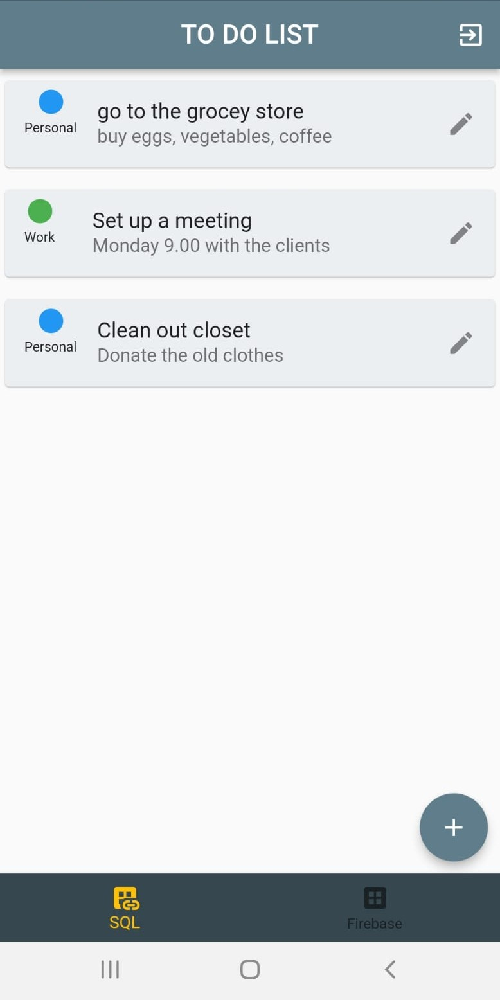

# Flutter To-Do List App with Firebase

A Flutter to-do list app that performs CRUD (Create, Read, Update, Delete) operations with SQLite and Firebase Cloud Firestore using cubit state management.

## Feautures
- Firebase Authentication: Implements user authentication using Firebase for secure login.
- CRUD Operations: Allows users to create, read, update, and delete tasks locally and on Firebase Cloud Firestore in real time.
- SQLite Local Storage: Utilizes SQLite for local data storage
- Firebase Cloud Firestore: Utilizes Firebase for remote data storage 
- Cubit State Management: Implements the Cubit pattern for effective state management.
- Dependency Injection: Utilizes dependency injection for organized and scalable code.
- Route Generator: Includes a route generator for smooth navigation between different screens.

## Getting Started
To run this project locally, follow these steps:

1. Clone the repository:
``` 
git clone https://github.com/AslihanYoldas/https://github.com/AslihanYoldas/flutter_to_do_v2.git
```
2. Navigate to the project directory:

```
cd flutter_to_do_v2.git
```
3. Install dependencies:
```
flutter pub get
```
4. Configure Firebase:

Create a new Firebase project on the Firebase Console.
Follow the instructions to add your Android and iOS apps to the project.
Download the google-services.json (for Android) and GoogleService-Info.plist (for iOS) configuration files and place them in the appropriate directories (android/app and ios/Runner, respectively).
Enable Email/Password authentication and set up Cloud Firestore in the Firebase Console.

5. Run the app:

``` 
flutter run
``` 

## Screenshots
### Login page 
- You can create a new user.
- You can log in to your existing account.
- You can toggle the visibility of your password by pressing the eye icon.


### Main Page
- You can switch between storing your data locally or remotely by using the bottom navigation bar.
- To add new tasks, simply press the "+" button.
- In the new task widget, you can enter the title, description, and category (work, personal, other) for your task.
- To delete a task, long-press on the task you want to delete.
- To update a task, press the pencil icon on the task.
- You can log out by pressing the exit icon located at the top right corner of the screen.





## Acknowledgments
- Firebase for providing the authentication and Cloud Firestore services.
- SQLite for local data storage. ([sqflite link](https://pub.dev/packages/sqflite))
- flutter_bloc package for the Cubit state management. ([block link](https://pub.dev/packages/flutter_bloc))
- get_it package for dependency injection. ([get_it link](https://pub.dev/packages/get_it))
- Flutter for the framework.

## Contributing
Feel free to contribute by opening issues or submitting pull requests. 

## Contact
For questions or feedback, contact aslihanyoldas24@gmail.com


